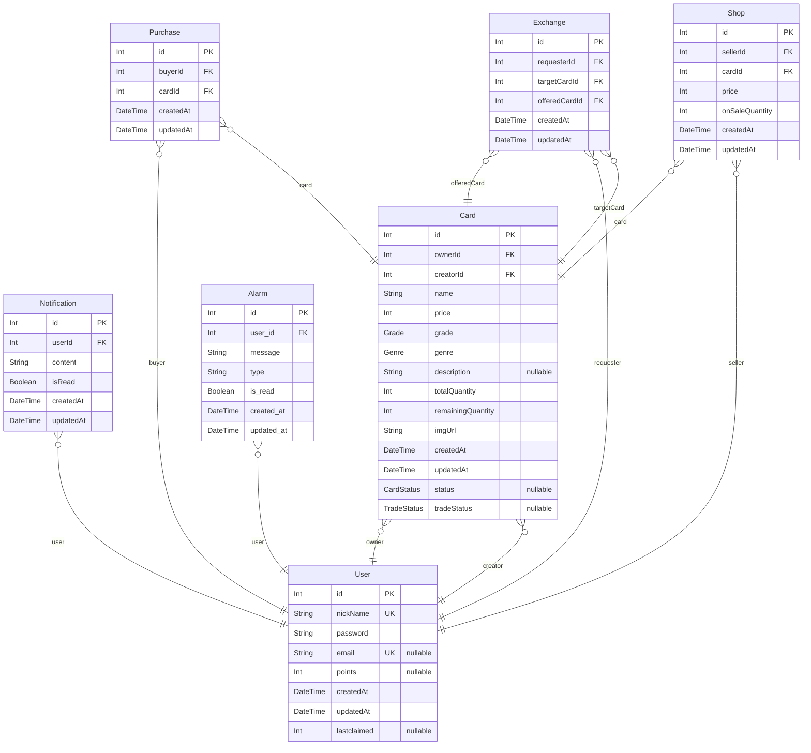

# ERD
> Generated by [`prisma-markdown`](https://github.com/samchon/prisma-markdown)

- [default](#default)

## default

### `User`

**Properties**
  - `id`: 
  - `nickName`: 
  - `password`: 
  - `email`: 
  - `points`: 
  - `createdAt`: 
  - `updatedAt`: 
  - `lastclaimed`: 

### `Notification`

**Properties**
  - `id`: 
  - `userId`: 
  - `content`: 
  - `isRead`: 
  - `createdAt`: 
  - `updatedAt`: 

### `Card`

**Properties**
  - `id`: 
  - `ownerId`: 
  - `creatorId`: 
  - `name`: 
  - `price`: 
  - `grade`: 
  - `genre`: 
  - `description`: 
  - `totalQuantity`: 
  - `remainingQuantity`: 
  - `imgUrl`: 
  - `createdAt`: 
  - `updatedAt`: 
  - `status`: 
  - `tradeStatus`: 

### `Purchase`

**Properties**
  - `id`: 
  - `buyerId`: 
  - `cardId`: 
  - `createdAt`: 
  - `updatedAt`: 

### `Exchange`

**Properties**
  - `id`: 
  - `requesterId`: 
  - `targetCardId`: 
  - `offeredCardId`: 
  - `createdAt`: 
  - `updatedAt`: 

### `Shop`

**Properties**
  - `id`: 
  - `sellerId`: 
  - `cardId`: 
  - `price`: 
  - `onSaleQuantity`: 
  - `createdAt`: 
  - `updatedAt`: 

### `Alarm`

**Properties**
  - `id`: 
  - `user_id`: 
  - `message`: 
  - `type`: 
  - `is_read`: 
  - `created_at`: 
  - `updated_at`: 